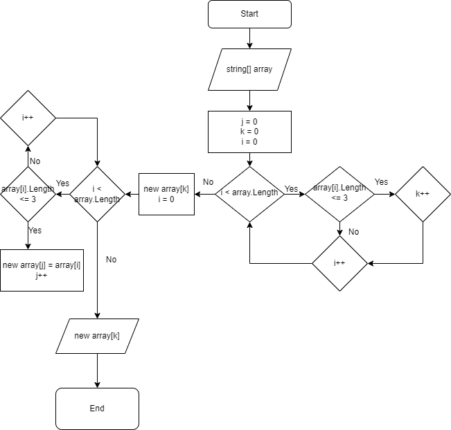

# Урок 1. Контрольная работа
Данная работа необходима для проверки ваших знаний и навыков по итогу прохождения первого блока обучения на программе Разработчик. Мы должны убедится, что базовое знакомство с IT прошло успешно.

Задача алгоритмически не самая сложная, однако для полноценного выполнения проверочной работы необходимо:

1. Создать репозиторий на GitHub
2. Нарисовать блок-схему алгоритма (можно обойтись блок-схемой основной содержательной части, если вы выделяете её в отдельный метод)
3. Снабдить репозиторий оформленным текстовым описанием решения (файл README.md)
4. Написать программу, решающую поставленную задачу
5. Использовать контроль версий в работе над этим небольшим проектом (не должно быть так, что всё залито одним коммитом, как минимум этапы 2, 3, и 4 должны быть расположены в разных коммитах)

Задача: Написать программу, которая из имеющегося массива строк формирует новый массив из строк, длина которых меньше, либо равна 3 символам. Первоначальный массив можно ввести с клавиатуры, либо задать на старте выполнения алгоритма. При решении не рекомендуется пользоваться коллекциями, лучше обойтись исключительно массивами.

***Примеры:*** 

***[“Hello”, “2”, “world”, “:-)”] → [“2”, “:-)”]***
***[“1234”, “1567”, “-2”, “computer science”] → [“-2”]***
***[“Russia”, “Denmark”, “Kazan”] → [] ***

# Порядок работы:

1. Создан репозиторий на GitHub.
2. Создана папка с проектом на ПК.
3. В Visual Studio Code создан проект на C#.
4. В рабочей папке создан локальный репозиторий.
5. Сделана блок-схема в draw.io.

6. Написание кода, ориентируясь на блок-схему.
7. Задачи, по сути, решена двумя немного разными способами. Сначала планировалось сделать с функцией вывода метода PrintArray, но потом понял, чтобы итоговый результат был похож на форму как в примере ([“Hello”, “2”, “world”, “:-)”] → [“2”, “:-)”]), проще использовать обычный WriteLine. Метд PrintArray закоменчен.
8. Дозалиты файлы README.md и схема с drawio.
9. Создан итоговый коммит и работа залита на GitHub.